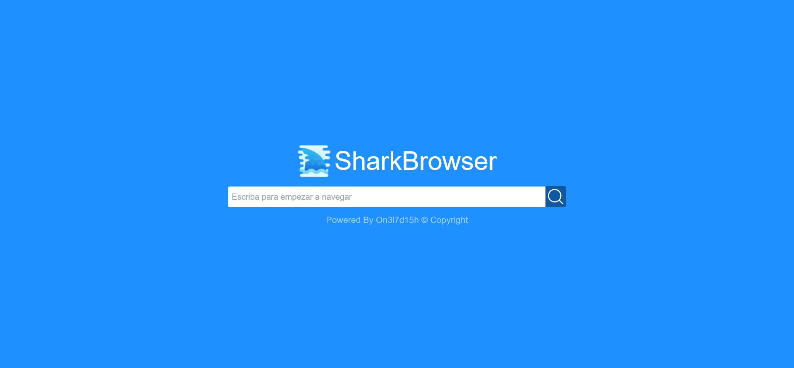

# Shark Search v1.0.0

---

Hello guys, what's up? at this time, i bring to you an interesting project, i called the Shark searcher to my Web Browser. So... I hope that you can enjoy it.

it's simple to use, like the moderns searchers, you just need to write something in the textfield, and you have two options:

> Click the button
> 
> Or Press Enter to start to navigate.

Ah! Something important, this searcher use DuckDuckGo so, enjoy this simple and flat searcher. you-ll the browser made with C# soon, but before that, enjoy this!

